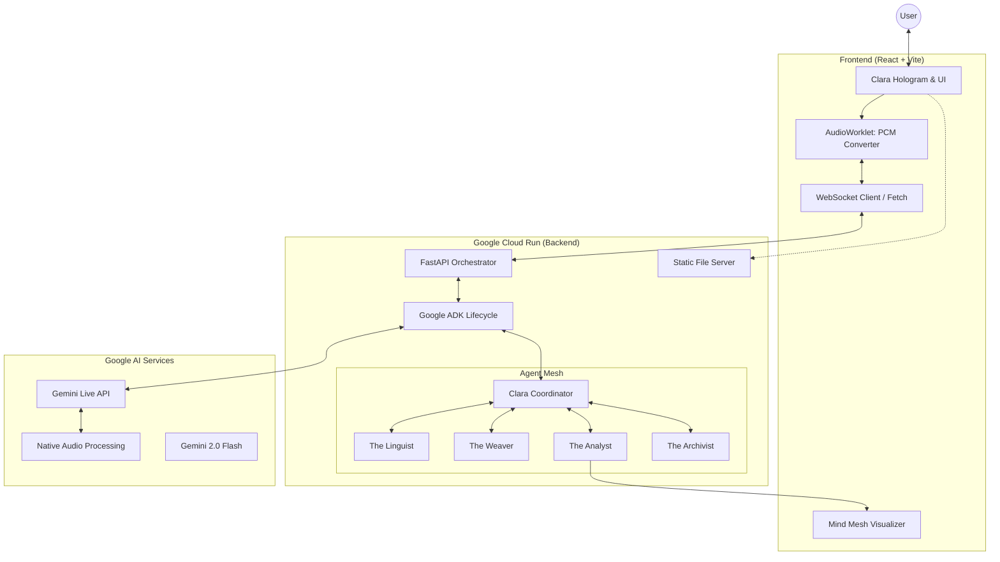

# ClariWeave AI Architecture

ClariWeave is a premium, real-time multimodal mental wellness agent...

## Core Architecture

The architecture follows a distributed frontend-backend pattern, bridging React/TypeScript with an advanced Python backend.

### 1. Frontend (React / TypeScript)
The frontend serves as the real-time multimodal capture and display layer, prioritizing robust `audio/pcm;rate=16000` compliance for the Live API.
- **Microphone & Audio Pipeline**: Uses `navigator.mediaDevices.getUserMedia` with a standard `AudioContext(sampleRate: 16000)`. It employs a custom `AudioWorkletNode` (`pcm-worker.js`) to capture float32 audio and cleanly convert it to the required 16-bit PCM (little-endian) mono format before transmission.
- **Video & Image Upload**: Facilitates providing visual stressors (e.g., messy desks, anxious notes) either via camera frames or direct image uploads, complementing the user's voice for deep multimodal reasoning.
- **Mind Mesh Visualizer**: An interactive SVG/Canvas-based visualization tab that renders the current "Neural Firing" of Clara's decentralized mind, providing full transparency into her reasoning.
- **WebSocket Transport**: All audio, video, and textual streams are sent asynchronously to the backend using `useLiveSession.ts`. It also handles incoming transcription updates, control messages (`interrupt`), and rich JSON payloads representing "Clarity Maps" and real-time biometric metrics.

### 2. Backend (FastAPI / Google ADK)
The Backend is the true orchestrator of ClariWeave, built around the rigorous ADK Lifecycle paradigm.
- **The Engine (Google ADK)**: The application initiates a `Runner` with an `InMemorySessionService`, binding connection state securely. The connection orchestrates raw upstream binary events with downstream `Part` generation from Gemini.
- **The "Tool Gate"**: To solve race conditions where Gemini enters a localized reasoning loop (e.g. searching the vector store) while the user continues to speak, the backend implements an `is_tool_executing` switch. Audio upstream dynamically halts when tools fire, preserving the integrity of turn-based responses without dropping the session.
- **Port Alignment**: Runs on port `8082` explicitly synchronized between the fast-moving upstream Vite dev server and the downstream Uvicorn app. 

### 3. The Agent Mesh
ClariWeave defines a central "Coordinator" agent utilizing Google ADK's `Agent` class alongside advanced prompting structures.
- **Clara (Coordinator)**: Serves as the user-facing avatar. Clara delegates work via a rigorous framework combination of ROSES and Chain of Thought (COT) to ensure every response has internal reasoning cross-referenced against "Visual Ground Truth" (e.g. user sound vs user camera feed).
- **Proactive Orchestration**: Clara is programmed to intervene pro-actively if visual stressors occur in the background, making her an active participant in the user's environment rather than a target for commands.
- **The Linguist**: Extracts verbatim intent from 100+ native languages during a stress event.
- **The Weaver**: Weaves emotional resonance and micro-actions into short, non-threatening vocal responses.
- **The Guardian**: Strictly enforces PII masking and ensures no medical/legal or financial advice is accidentally spawned.
- **The Analyst**: Periodically synthesizes the session state into a structured schema for the live infographic dashboard.

### 4. Integration with Gemini 2.5 Flash Native Audio
The entire node leverages the `gemini-2.5-flash-native-audio-latest` model.
- Response Modalities are strictly locked to `[Modality.AUDIO]`.
- Output audio is successfully processed by the Live API and streamed down via ADK `event.content.parts`. The binary is routed back through the continuous WebSocket to the browser.
